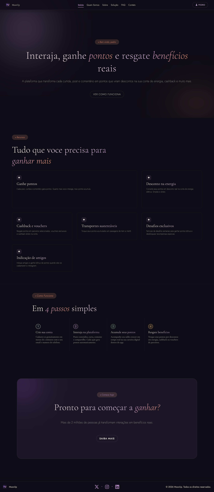
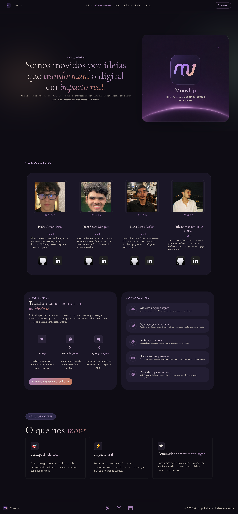
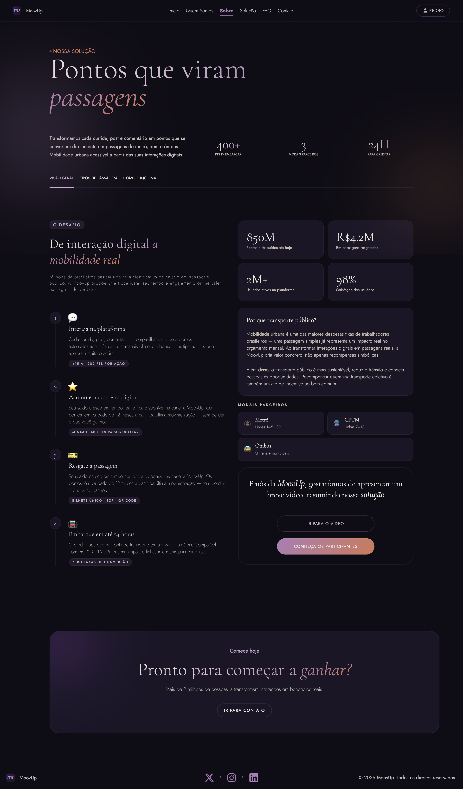
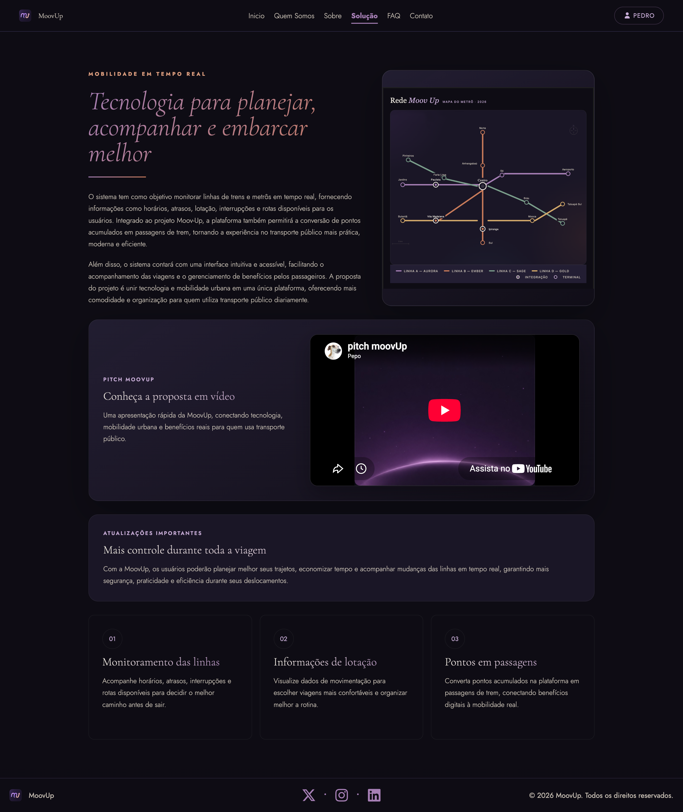
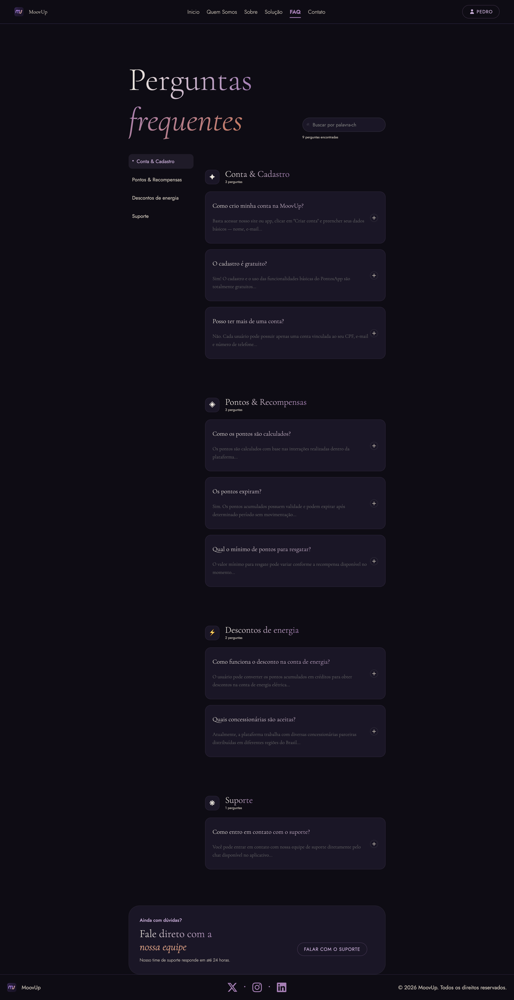
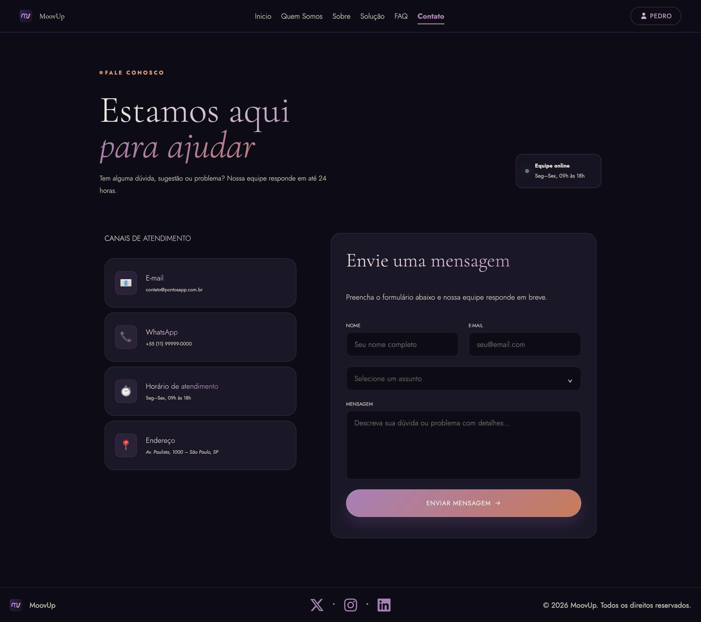

# 🚌 MoovUp — Pontos que Movem Você

> Plataforma de engajamento gamificado que transforma interações dos usuários em pontos trocáveis por benefícios reais: desconto na conta de energia, cashback, vouchers e passagens de trem/metrô.

---

## 📋 Descrição

A **MoovUp** é uma solução digital desenvolvida como projeto da disciplina de **Front-End** na FIAP, como parte do **Challenge 2026 — 2º semestre**.

O projeto consiste em uma SPA (Single Page Application) completa e responsiva que apresenta a proposta da plataforma MoovUp: converter interações do dia a dia — curtidas, posts, comentários, participação em campanhas — em pontos, e permitir que esses pontos sejam trocados por descontos na conta de energia elétrica, cashback, vouchers de parceiros e até passagens de trem/metrô.

O site foi construído com **React, TypeScript e Vite**, com roteamento via **React Router**, sem o uso de bibliotecas de UI prontas (Bootstrap, Material UI, Chakra etc.), aplicando boas práticas de componentização, tipagem estática, semântica e responsividade.

---

## 🚀 Funcionalidades

- **Header e modal de login** com persistência do usuário em `localStorage`
- **Home** com hero, grade de recursos e seção "como funciona" em 4 passos
- **Quem Somos** com apresentação da equipe e popup com bio, foto e redes de cada integrante
- **Sobre** com navegação por abas apresentando a visão geral da solução
- **Solução** com vídeo de pitch incorporado, destaques e cards de recursos
- **FAQ** com perguntas organizadas por categoria, sidebar com scroll-spy e busca em tempo real que filtra as perguntas
- **Contato** com canais de atendimento e formulário de mensagem
- **Roteamento client-side** entre todas as páginas com React Router
- **Design responsivo** construído com CSS modular (variáveis, Grid e Flexbox)

---

## 🛠️ Tecnologias Utilizadas

| Tecnologia | Uso |
|---|---|
| React 19 | Biblioteca de componentes da interface |
| TypeScript | Tipagem estática de componentes, props e dados |
| Vite | Build tool e servidor de desenvolvimento |
| React Router DOM 7 | Roteamento entre as páginas da SPA |
| TailwindCSS 4 | Estilização utilitária de toda a interface, com tokens de tema (cores, fontes, gradientes) via `@theme` |
| React Hook Form | Validação e gerenciamento dos formulários (Contato e login) |
| Font Awesome | Ícones de interface e redes sociais |
| Oxlint | Linting do código |
| Git + GitHub | Versionamento e colaboração |

---

## 📱 Responsividade

O layout é **mobile-first**: as classes do Tailwind sem prefixo já são o estilo de mobile, e dois breakpoints customizados (definidos em `@theme`, dentro de `src/global.css`) escalam o layout para telas maiores.

| Prefixo Tailwind | Breakpoint | Faixa de tela |
|---|---|---|
| _(sem prefixo)_ | — | Mobile, até 767px (cobre o "até 480px" do enunciado) |
| `tablet:` | `48rem` (768px) | Tablet, 768px+ |
| `desktop:` | `62rem` (992px) | Desktop, 992px+ |

Exemplo: `grid-cols-1 tablet:grid-cols-2 desktop:grid-cols-4` empilha os cards no celular, exibe 2 colunas no tablet e 4 no desktop.

---

## 📁 Estrutura de Pastas

```
moovup/
│
├── index.html                        # Ponto de entrada da aplicação
├── public/                           # Arquivos estáticos servidos diretamente
│
└── src/
    ├── main.tsx                      # Bootstrap da aplicação (React + Router + global.css)
    ├── App.tsx                       # Componente raiz
    ├── global.css                    # Import do TailwindCSS + tokens de tema (@theme) + reset base
    │
    ├── routes/
    │   └── AppRoutes.tsx              # Definição de todas as rotas da SPA
    │
    ├── pages/                         # Uma pasta por página (padrão pages/<Nome>/<Nome>.tsx)
    │   ├── Home/Home.tsx
    │   ├── QuemSomos/QuemSomos.tsx
    │   ├── Sobre/Sobre.tsx
    │   ├── Solucao/Solucao.tsx
    │   ├── Faq/Faq.tsx
    │   └── Contato/Contato.tsx
    │
    ├── components/
    │   ├── layout/                    # Header, Footer, Layout, Modal de login, ScrollToTop
    │   ├── common/                    # Button, Accordion, TeamPopup, Foot (CTA), FaqSidebar
    │   └── sobre/                     # Componentes específicos da página Sobre (Overview, PassType, Info)
    │
    ├── data/                          # Dados estáticos (equipe, abas da solução)
    ├── types/                         # Interfaces e tipos compartilhados (equipe, solução, formulários de contato e login)
    └── assets/                        # Imagens, ícones e fotos da equipe
```

---

## 📸 Imagens do Projeto

> Capturas de tela em `docs/screenshots/`. Salve os prints com esses nomes de arquivo (ou ajuste os caminhos abaixo se preferir outros nomes).

### Página Inicial


### Quem Somos


### Sobre


### Solução


### FAQ


### Contato


---

## 🖥️ Como Executar Localmente

```bash
# 1. Clone o repositório
git clone https://github.com/challenge-2026-MoovUp/challenge-2026-FrontEnd-2sem.git

# 2. Acesse a pasta do projeto
cd challenge-2026-FrontEnd-2sem

# 3. Instale as dependências
npm install

# 4. Rode o servidor de desenvolvimento
npm run dev
```

O projeto ficará disponível em `http://localhost:5173`.

Outros scripts disponíveis:

```bash
npm run build     # gera o build de produção
npm run preview   # serve o build de produção localmente
npm run lint      # roda o linter (Oxlint)
```

---

## 👥 Autores e Créditos

| Foto | Nome | RM | Turma | GitHub | LinkedIn |
|---|---|---|---|---|---|
|  | **Pedro Amaro Pires** | RM570636 | 1TDSPJ | [pedroamarop](https://github.com/pedroamarop) | [pedro-amaro-pires](https://www.linkedin.com/in/pedro-amaro-pires) |
|  | **Juan Souza Marques** | RM573469 | 1TDSPJ | [juansouzamarques](https://github.com/juansouzamarques) | [juan-marques](https://www.linkedin.com/in/juan-marques-297b293b4/) |
|  | **Lucas Leite Carlos** | RM571985 | 1TDSPJ | [Leite-1309](https://github.com/Leite-1309) | [lucas-leite-carlos](https://www.linkedin.com/in/lucas-leite-carlos-5b72973a9/) |
|  | **Matheus Matsushita de Souza** | RM570017 | 1TDSPJ | [Matsushita1907](https://github.com/Matsushita1907) | [matheus-matsushita](https://www.linkedin.com/in/matheus-matsushita-de-souza-543269346/) |

---

## 🔗 Repositório

[](https://github.com/challenge-2026-MoovUp/challenge-2026-FrontEnd-2sem)

> **Link direto:** https://github.com/challenge-2026-MoovUp/challenge-2026-FrontEnd-2sem

---

## 🎥 Vídeo de Apresentação

Demonstração em vídeo do projeto MoovUp, com navegação por todas as páginas:

[](https://youtu.be/F6HE8IUwCH4)

> **Link direto:** https://youtu.be/F6HE8IUwCH4

---

## 📬 Contato

Para dúvidas ou sugestões sobre o projeto:

- **Pedro Amaro** — [LinkedIn](https://www.linkedin.com/in/pedro-amaro-pires) · [GitHub](https://github.com/pedroamarop)
- **Juan Marques** — [LinkedIn](https://www.linkedin.com/in/juan-marques-297b293b4/) · [GitHub](https://github.com/juansouzamarques)
- **Lucas Leite** — [LinkedIn](https://www.linkedin.com/in/lucas-leite-carlos-5b72973a9/) · [GitHub](https://github.com/Leite-1309)
- **Matheus Matsushita** — [LinkedIn](https://www.linkedin.com/in/matheus-matsushita-de-souza-543269346/) · [GitHub](https://github.com/Leite-1309)

---

## 📄 Licença

Projeto desenvolvido para fins acadêmicos — **FIAP Challenge 2026, 2º semestre**.
Todos os direitos reservados aos autores.

---

<p align="center">
  Desenvolvido com 🚌 pela equipe <strong>MoovUp</strong> — FIAP 2026
</p>
